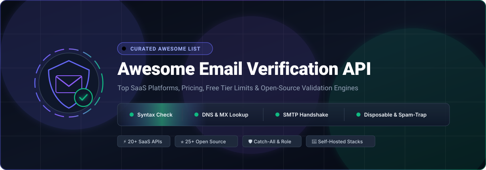
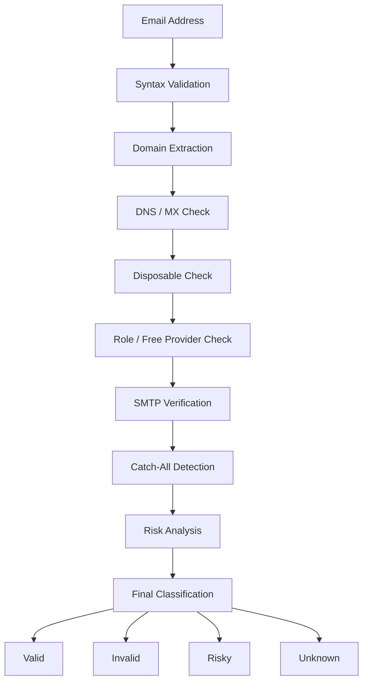
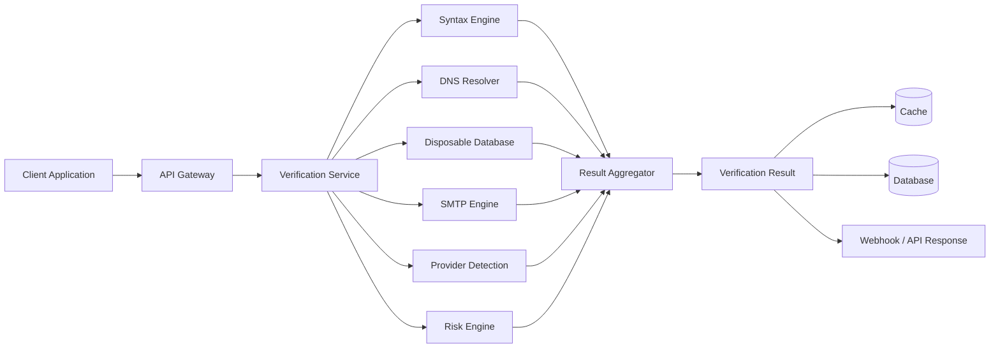
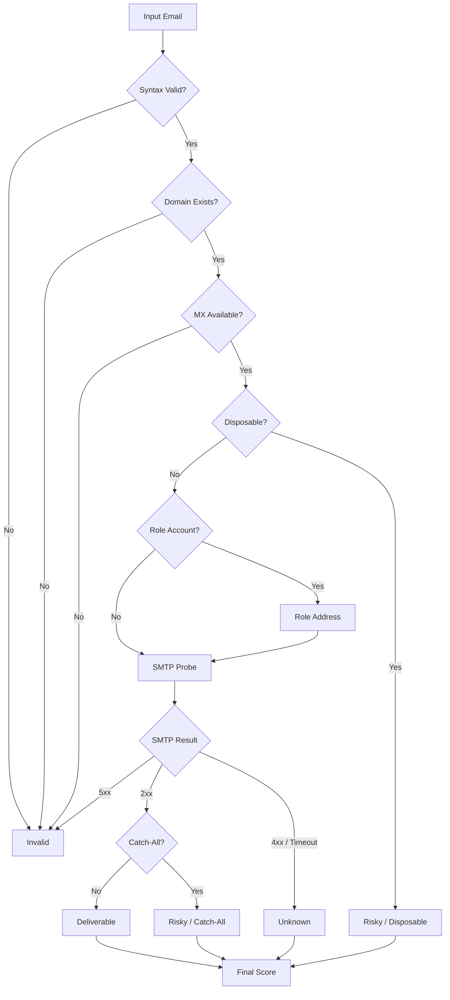
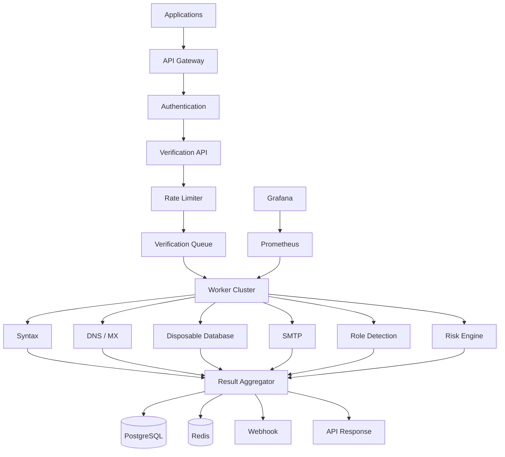

<p align="center">
  <a href="https://github.com/ishandutta2007/Awesome-Email-Verification-API">
    
  </a>
</p>

# ✉️ Awesome Email Verification API 🚀

<p align="center">
  <a href="https://github.com/ishandutta2007/Awesome-Awesome-Awesome"></a><a href="https://discord.gg/jc4xtF58Ve"></a>
  <a href="https://github.com/ishandutta2007/Awesome-Email-Verification-API/stargazers"></a>
  <a href="https://github.com/ishandutta2007/Awesome-Email-Verification-API/blob/main/LICENSE"></a>
  <a href="https://github.com/ishandutta2007/Awesome-Email-Verification-API/pulls"></a>
  <a href="https://github.com/ishandutta2007"></a>
</p>

---

> 🎯 A comprehensive, SEO-optimized curated directory of **Email Verification APIs**, commercial validation SaaS platforms, pricing models, free tier limits, and **self-hosted open-source alternatives**. Master email hygiene, improve sender reputation, prevent bounces, detect disposable domains, perform live SMTP handshakes, and build high-throughput email verification pipelines.

### 🔍 What is Email Verification? 🛡️

**Email Verification APIs** and libraries validate whether an email address is **deliverable, valid, invalid, risky, disposable, temporary, role-based, catch-all, or a spam trap**—without sending a message. Essential for:
- 🚀 **SaaS Onboarding & Signups:** Block fake signups, bot attacks, and burner emails in real time.
- 📈 **B2B Cold Outreach & Sales:** Keep bounce rates under 2% to protect Google Workspace & Outlook inbox sender reputation.
- 🧹 **Bulk CRM Hygiene & List Cleaning:** Cleanse millions of leads across HubSpot, Salesforce, and Mailchimp.
- 🏢 **Self-Hosted Infrastructure:** Build private, air-gapped, zero-cost email validation engines using Go, Rust, Python, and TypeScript.

---


## 📑 Table of Contents


* [☁️ SaaS/Hosted Platforms](#️-saashosted-platforms)

* [🌍 Open-Source](#-open-source)

* [📧 Open-Source Email Verification Engines](#-open-source-email-verification-engines)

* [🌐 Open-Source DNS & MX Verification](#-open-source-dns--mx-verification)

* [📡 Open-Source SMTP Verification](#-open-source-smtp-verification)

* [🗑️ Open-Source Disposable Email Detection](#️-open-source-disposable-email-detection)

* [👤 Open-Source Role-Based Email Detection](#-open-source-role-based-email-detection)

* [🔤 Open-Source Email Syntax Validation](#-open-source-email-syntax-validation)

* [🧠 Open-Source Email Intelligence & Enrichment](#-open-source-email-intelligence--enrichment)

* [⚡ Open-Source Email Verification APIs](#-open-source-email-verification-apis)

* [📊 Open-Source Bulk Email Verification](#-open-source-bulk-email-verification)

* [🏗️ Email Verification Architecture](#️-email-verification-architecture)

* [🔄 Open-Source Email Verification Architecture](#-open-source-email-verification-architecture)

* [🧩 Commercial Platform → Open-Source Equivalent](#-commercial-platform--open-source-equivalent)

* [⚖️ Commercial vs Open-Source](#️-commercial-vs-open-source)

* [🚀 Recommended Open-Source Stacks](#-recommended-open-source-stacks)

* [🔬 Email Verification Pipeline](#-email-verification-pipeline)

* [🎯 Verification Result Classification](#-verification-result-classification)

* [🔐 Enterprise Email Verification Architecture](#-enterprise-email-verification-architecture)

* [🌐 Open-Source Email Verification Landscape](#-open-source-email-verification-landscape)

* [🤝 Contributing](#-contributing)

* [⚠️ Disclaimer](#️-disclaimer)

* [⭐ Star History](#-star-history)


---


# ☁️ SaaS/Hosted Platforms


Commercial Email Verification APIs provide managed validation infrastructure, DNS/MX checks, SMTP verification, disposable-email detection, catch-all detection, spam-trap detection, bulk validation and integrations.


> 📊 **Market Overview:** The global email verification and deliverability software market is estimated at **$710M – $790M** (expanding to **~$2.8B** when including broader email security & deliverability infrastructure), growing at a **CAGR of ~9.8%** toward **$1.1B – $6.4B by 2030–2034**. The sector is **moderately to highly fragmented** rather than a winner-take-all market, featuring enterprise consolidation (e.g., ZoomInfo, Validity, SparkPost/Bird) alongside dozens of profitable independent niche verifiers and specialized API vendors.

| Platform | Company | Company Size (Rev / Valuation) | Primary Focus | Pricing | Free Tier Limit | Key Capabilities |
| -------------------------------------------------------------------------------------------- | ---------------------- | ------------------------------------- | --------------------------------- | ------------------------------------------------------------------------------------------------- | ------------------------------------------------------------------------------------------ | ----------------------------------------------------------------------------------------------------- |
| [NeverBounce](https://neverbounce.com/) | ZoomInfo | ~$1.2B Rev / ~$1.2B Market Cap (NASDAQ: ZI) | Email Verification | Starts at $8 for 1,000 credits ($0.008/email Pay-as-you-go) or $49/mo (sync) | 10 free credits upon signup (One-time trial) + free list analysis | Real-time API, bulk verification, list cleaning, disposable detection, validation |
| [MailboxValidator](https://www.mailboxvalidator.com/) | SparkPost / Bird | ~$600M Acq. Valuation / Bird ~$500M Rev | Email Verification | Starts at $19.95 for 1,000 credits (Bulk) or $9.95/mo for 1,000 queries/mo (API) | 300 queries/month (Free forever API plan) or 100 credits free trial | Syntax, MX, SMTP, disposable, free-provider and domain validation |
| [BriteVerify](https://www.validity.com/products/briteverify/) | Validity | ~$62M – $70M ARR / ~$300M+ Valuation | Email Verification & Data Quality | Starts at $40 for 5,000 verifications ($0.008/verification Pay-as-you-go) | 1,000 free credits for 30-day trial (via DemandTools trial) or sales demo | Real-time and bulk verification, data quality and deliverability |
| [Mailboxlayer](https://mailboxlayer.com/) | apilayer / Idera | ~$15M ARR (Parent Idera ~$3B+ Valuation) | Email Validation API | Starts at $14.99/mo for Basic (5,000 requests/month) | 100 requests/month (Free forever plan) | Syntax, MX, SMTP, disposable, role and free-provider detection |
| [ZeroBounce](https://www.zerobounce.net/) | ZeroBounce | ~$10M – $25M ARR (Inc. 5000) | Email Validation & Deliverability | Starts at $39 for 2,000 credits (Pay-as-you-go) or $99/mo (10,000 credits/mo) | 100 credits/month (Free forever, refreshes monthly) | Real-time/bulk validation, SMTP checks, spam-trap detection, disposable detection, catch-all, scoring |
| [Hunter Email Verifier](https://hunter.io/email-verifier) | Hunter | ~$8M – $10M ARR (Bootstrapped) | Email Verification | Starts at $49/mo (or $34/mo billed annually) for 2,000 credits/mo | 50 credits/month (Free forever, up to 100 email verifications/mo) | Email verification API, syntax, domain, SMTP and deliverability checks |
| [Bouncer](https://usebouncer.com/) | Bouncer | ~$7.5M ARR | Email Verification | Starts at $8 for 1,000 credits ($0.008/email Pay-as-you-go) or $24/mo | 100 free credits upon signup (One-time trial, no credit card required) | Real-time/bulk verification, deliverability, toxicity detection, disposable detection |
| [Clearout](https://clearout.io/) | Clearout | ~$5M ARR | Email Verification | Starts at $21 for 3,000 credits (Pay-as-you-go) or $19.50/mo (3,000 credits/mo) | 100 free credits upon signup (One-time trial, credits never expire) | Real-time/bulk validation, catch-all, disposable, spam-trap and role detection |
| [Kickbox](https://kickbox.com/) | Kickbox | ~$2.3M – $5M ARR | Email Verification | Starts at $5 for 500 credits ($0.01/email) or $10 for 1,000 credits | 100 free credits upon signup (One-time trial) | API, bulk verification, deliverability, risk analysis, integrations |
| [Emailable](https://emailable.com/) | Emailable | ~$1.9M ARR (Cache Ventures) | Email Verification | Starts at $38 for 5,000 credits (Pay-as-you-go) or $32.30/mo | 250 free credits upon signup (One-time trial, credits never expire) | Real-time API, bulk verification, syntax/DNS/SMTP checks, risk analysis |
| [Abstract Email Verification](https://www.abstractapi.com/email-verification-validation-api) | Abstract API | ~$1.5M – $3M ARR | Email Validation API | Starts at $19/mo (or $9/mo billed annually) for 10,000 requests/mo | 100 requests/month (Free forever, 3 req/sec rate limit) | Syntax, MX, SMTP, disposable, free-provider and quality checks |
| [QuickEmailVerification](https://quickemailverification.com/) | QuickEmailVerification | ~$1M – $2.5M ARR | Email Verification | Starts at $4.00 for 500 credits ($0.008/email Pay-as-you-go) | 100 credits/day (~3,000 credits/month, Free forever, resets daily) | API, bulk validation, SMTP verification, disposable detection |
| [Verifalia](https://verifalia.com/) | Verifalia | ~$1M – $2M ARR | Email Validation | Starts at $9/mo for Starter (250 credits/day) or $7.90 for 1,000 credits | 25 credits/day (~750 credits/month, Free forever, resets daily) | Real-time and bulk verification, syntax/DNS/SMTP, disposable and catch-all detection |
| [EmailListVerify](https://emaillistverify.com/) | EmailListVerify | ~$1M – $2M ARR | Email Verification | Starts at $5 for 1,000 credits ($0.005/email Pay-as-you-go) or $139/mo | 100 free credits upon signup (One-time trial) | Bulk list cleaning, API, SMTP, disposable and catch-all detection |
| [Xverify](https://www.xverify.com/) | Xverify | ~$1M – $2M ARR | Contact Validation | Starts at $5 for 500 verifications ($0.01/verification Pay-as-you-go) | 100 free credits upon signup (One-time trial) + 5 checks/day on website | Email, phone and postal validation |
| [DeBounce](https://debounce.io/) | DeBounce | ~$800K – $1.5M ARR | Email Validation | Starts at $10 for 5,000 credits ($0.002/email Pay-as-you-go) | 100 free credits upon signup (One-time trial, no credit card required) | Bulk validation, API, SMTP checks, disposable detection, catch-all detection |
| [EmailOversight](https://www.emailoversight.com/) | EmailOversight | ~$500K – $1M ARR | Email Hygiene | Starts at $70/mo for up to 10,000 verifications/month | 200 free credits upon signup (Trial plan, active until credits exhausted) | Verification, suppression and list cleaning |
| [MillionVerifier](https://www.millionverifier.com/) | MillionVerifier | ~$440K – $1M ARR | Bulk Email Verification | Starts at $39 for 10,000 credits (Pay-as-you-go; promo $4.90 for 2,000) | 100 free credits upon signup (up to 500 for business email, one-time trial) | Bulk validation, API, SMTP and deliverability checks |
| [Captain Verify](https://captainverify.com/) | Captain Verify | ~$400K – $800K ARR | Email Verification | Starts at €7 (~$7.60) for 1,000 credits (Pay-as-you-go) | 100 free credits upon signup (One-time trial) + 3 checks/day on website | Bulk and real-time verification |
| [Proofy](https://proofy.io/) | Proofy | ~$300K – $600K ARR | Email Verification | Starts at $5 for 5,000 credits (Starter package Pay-as-you-go) | 100 free credits upon registration (One-time trial) + free web checker | Bulk verification, API, SMTP, disposable and catch-all detection |


> **Note:** Commercial providers use different verification methodologies. A service returning `valid`, `deliverable`, or `safe` does not guarantee that a message will ultimately be delivered.


---


# 🌍 Open-Source


Unlike commercial providers, open-source email verification generally works by combining several independent checks:


```text

Email Address

     │

     ├── Syntax

     │

     ├── Domain

     │

     ├── DNS / MX

     │

     ├── Disposable Domain

     │

     ├── Role Account

     │

     ├── Free Provider

     │

     ├── SMTP

     │

     ├── Catch-All

     │

     └── Risk Signals

              │

              ▼

       Verification Result

```


The strongest open-source implementations therefore tend to be **composable systems rather than a single ZeroBounce-like project**.


---


# 📧 Open-Source Email Verification Engines


| Project | License | Description |
| -------------------------------------------------------------------------------------------------------------------------------------------------- | ----------- | ------------------------------------------------------------------------------------------------------------------------- |
| [check-if-email-exists](https://github.com/reacherhq/check-if-email-exists) [](https://github.com/reacherhq/check-if-email-exists/stargazers) | AGPL-3.0 | High-performance Rust email verification library, CLI, and HTTP backend with syntax, MX, and SMTP probing |
| [AfterShip Email Verifier](https://github.com/AfterShip/email-verifier) [](https://github.com/AfterShip/email-verifier/stargazers) | MIT | Go email verification library with syntax, DNS, MX, SMTP, catch-all, disposable and role checks |
| [Python Email Validator](https://github.com/JoshData/python-email-validator) [](https://github.com/JoshData/python-email-validator/stargazers) | Unlicense | Robust Python email syntax and deliverability validation library |
| [Truemail](https://github.com/truemail-rb/truemail) [](https://github.com/truemail-rb/truemail/stargazers) | MIT | Configurable framework-agnostic Ruby email verification engine with Regex, MX, DNS, and SMTP validation |
| [checkmail](https://github.com/badoux/checkmail) [](https://github.com/badoux/checkmail/stargazers) | MIT | Zero-dependency Go package for format validation, MX server lookup, and live SMTP probing |
| [Visulima Email Verifier](https://github.com/visulima/visulima/tree/main/packages/email/email-verifier) [](https://github.com/visulima/visulima/stargazers) | MIT | Comprehensive TypeScript email verification and enrichment library with DNS/SMTP, disposable, role and provider detection |
| [UnlimitedVerifier](https://github.com/unlimitedverifier/free-email-verifier) [](https://github.com/unlimitedverifier/free-email-verifier/stargazers) | MIT | Lightweight Python email verifier using syntax, MX and SMTP validation |
| [Email Verifier](https://github.com/yolodex-ai/email-verifier) [](https://github.com/yolodex-ai/email-verifier/stargazers) | MIT | Node.js verifier using syntax, DNS, MX, SMTP probing, catch-all and provider detection |
| [Email Validator](https://github.com/sagnik11/email-checker) [](https://github.com/sagnik11/email-checker/stargazers) | Open Source | TypeScript validator with syntax, DNS, SMTP, disposable and B2C detection |
| [Email Verification Tool](https://github.com/SyedSamrozeAli/Email-Verification-Tool) [](https://github.com/SyedSamrozeAli/Email-Verification-Tool/stargazers) | Open Source | Local CSV email verification application using MX, SMTP and syntax checks |


---


# 🌐 Open-Source DNS & MX Verification


DNS/MX verification determines whether a domain is configured to receive email.


| Project | Language | Description |
| ----------------------------------------------------------------------------------------------------------------------------------------- | -------- | -------------------------------------------------------------- |
| [miekg/dns](https://github.com/miekg/dns) [](https://github.com/miekg/dns/stargazers) | Go | Full-featured, high-performance DNS library in Go |
| [Hickory DNS](https://github.com/hickory-dns/hickory-dns) [](https://github.com/hickory-dns/hickory-dns/stargazers) | Rust | Modern Rust DNS client, resolver, and server implementation (formerly Trust-DNS) |
| [dnspython](https://github.com/rthalley/dnspython) [](https://github.com/rthalley/dnspython/stargazers) | Python | Comprehensive DNS toolkit supporting MX, A, AAAA, TXT and other record types |
| [c-ares](https://github.com/c-ares/c-ares) [](https://github.com/c-ares/c-ares/stargazers) | C | Asynchronous DNS resolution and name resolution library |
| [AfterShip Email Verifier](https://github.com/AfterShip/email-verifier) [](https://github.com/AfterShip/email-verifier/stargazers) | Go | Includes robust MX record lookup and domain DNS validation |
| [Python Email Validator](https://github.com/JoshData/python-email-validator) [](https://github.com/JoshData/python-email-validator/stargazers) | Python | Performs deliverability and domain DNS MX record validation |
| [getdns](https://github.com/getdnsapi/getdns) [](https://github.com/getdnsapi/getdns/stargazers) | C | Modern asynchronous DNS API and resolver library |


### MX Verification


```text

user@example.com

       │

       ▼

   Extract Domain

       │

       ▼

   example.com

       │

       ▼

    DNS Query

       │

       ▼

    MX Records?

      /      \

    YES       NO

     │         │

     ▼         ▼

Continue    A/AAAA fallback

```


A domain without a usable mail-exchange configuration is generally a strong signal that an address cannot receive normal email.


---


# 📡 Open-Source SMTP Verification


SMTP verification attempts to determine whether a receiving mail server will accept a recipient address without actually sending a message.


| Project | Language | Description |
| -------------------------------------------------------------------------------------------------------------------------------------------------- | ---------- | -------------------------------------------------------- |
| [check-if-email-exists](https://github.com/reacherhq/check-if-email-exists) [](https://github.com/reacherhq/check-if-email-exists/stargazers) | Rust | High-performance asynchronous SMTP probing with MX routing and deliverability checks |
| [AfterShip Email Verifier](https://github.com/AfterShip/email-verifier) [](https://github.com/AfterShip/email-verifier/stargazers) | Go | SMTP verification with catch-all detection |
| [Truemail](https://github.com/truemail-rb/truemail) [](https://github.com/truemail-rb/truemail/stargazers) | Ruby | Multi-layer SMTP handshake probing and host-level validation |
| [checkmail](https://github.com/badoux/checkmail) [](https://github.com/badoux/checkmail/stargazers) | Go | Lightweight live SMTP handshake and RCPT probing |
| [Visulima Email Verifier](https://github.com/visulima/visulima/tree/main/packages/email/email-verifier) [](https://github.com/visulima/visulima/stargazers) | TypeScript | SMTP probing with greylisting and mailbox-state handling |
| [UnlimitedVerifier](https://github.com/unlimitedverifier/free-email-verifier) [](https://github.com/unlimitedverifier/free-email-verifier/stargazers) | Python | SMTP verification without sending an email |
| [Email Verifier](https://github.com/yolodex-ai/email-verifier) [](https://github.com/yolodex-ai/email-verifier/stargazers) | Node.js | SMTP RCPT probing and catch-all detection |
| [Email Validator](https://github.com/sagnik11/email-checker) [](https://github.com/sagnik11/email-checker/stargazers) | TypeScript | Live SMTP handshakes |
| [Email Verification Tool](https://github.com/SyedSamrozeAli/Email-Verification-Tool) [](https://github.com/SyedSamrozeAli/Email-Verification-Tool/stargazers) | Python | Bulk SMTP verification |


### SMTP Verification


```text

Client

  │

  │ EHLO

  ▼

Mail Server

  │

  │ MAIL FROM

  ▼

Mail Server

  │

  │ RCPT TO:<user@example.com>

  ▼

 ┌─────────────────────┐

 │ SMTP Response       │

 ├─────────────────────┤

 │ 2xx → accepted      │

 │ 4xx → temporary     │

 │ 5xx → rejected      │

 └─────────────────────┘

```


> **Important:** SMTP verification is inherently imperfect. Greylisting, anti-enumeration systems, catch-all servers, firewalls, tarpits and temporary failures can make an address appear `unknown` even when it is valid.


---


# 🗑️ Open-Source Disposable Email Detection


Disposable/temporary email addresses are frequently used for short-lived registrations, trials, abuse and spam.


| Project | License | Description |
| ------------------------------------------------------------------------------------------------------------------------------------------------------------------------- | ------------ | --------------------------------------------------------------------- |
| [disposable-email-domains](https://github.com/disposable-email-domains/disposable-email-domains) [](https://github.com/disposable-email-domains/disposable-email-domains/stargazers) | CC0-1.0 | Large community-maintained disposable email domain blocklist |
| [mailchecker](https://github.com/FGRibreau/mailchecker) [](https://github.com/FGRibreau/mailchecker/stargazers) | MIT | Cross-platform, multi-language temporary disposable email detection library |
| [disposable](https://github.com/disposable/disposable) [](https://github.com/disposable/disposable/stargazers) | MIT | Disposable and temporary email domain database with automated daily updates |
| [burner-email-providers](https://github.com/wesbos/burner-email-providers) [](https://github.com/wesbos/burner-email-providers/stargazers) | MIT | Curated list of burner and disposable email providers |
| [disposable-domains](https://github.com/disposable/disposable-email-domains) [](https://github.com/disposable/disposable-email-domains/stargazers) | MIT | Daily-updated disposable-domain dataset |
| [Laravel Disposable Email](https://github.com/Propaganistas/Laravel-Disposable-Email) [](https://github.com/Propaganistas/Laravel-Disposable-Email/stargazers) | MIT | Disposable email validation package for Laravel applications |
| [fakefilter](https://github.com/7c/fakefilter) [](https://github.com/7c/fakefilter/stargazers) | BSD-3-Clause | Disposable email domain filtering dataset and checker |
| [email-disposable](https://github.com/gtkppr/email-disposable) [](https://github.com/gtkppr/email-disposable/stargazers) | MIT | Regularly updated disposable email domain list and JavaScript library |
| [Temporary Email Domain List](https://github.com/TempMailDetector/Temporary-Email-Domain-Blocklist) [](https://github.com/TempMailDetector/Temporary-Email-Domain-Blocklist/stargazers) | Open Source | Temporary and disposable email domain blocklist |


A disposable-domain check is generally much cheaper than an SMTP verification and should therefore be performed early in a verification pipeline.


---


# 👤 Open-Source Role-Based Email Detection


Role addresses represent functional accounts rather than individual recipients.


Common examples:


```text

admin@

support@

sales@

info@

contact@

billing@

hello@

marketing@

security@

webmaster@

postmaster@

```


| Project | Description |
| ------------------------------------------------------------------------------------------------------------------------------------------------------------------------- | ----------------------------------------------------------- |
| [disposable-email-domains](https://github.com/disposable-email-domains/disposable-email-domains) [](https://github.com/disposable-email-domains/disposable-email-domains/stargazers) | Community email-domain dataset useful for validation pipelines |
| [AfterShip Email Verifier](https://github.com/AfterShip/email-verifier) [](https://github.com/AfterShip/email-verifier/stargazers) | Role-account detection and common administrative mailbox filtering |
| [Truemail](https://github.com/truemail-rb/truemail) [](https://github.com/truemail-rb/truemail/stargazers) | Built-in role account and blacklisted address detection rules |
| [Visulima Email Verifier](https://github.com/visulima/visulima/tree/main/packages/email/email-verifier) [](https://github.com/visulima/visulima/stargazers) | Detects role-based and no-reply functional mailboxes |


Role detection does **not** mean an address is invalid. A `support@example.com` mailbox can be completely deliverable.


---


# 🔤 Open-Source Email Syntax Validation


| Project | Language | Description |
| -------------------------------------------------------------------------------------------------------------------------------------------------- | ---------- | ------------------------------------------------------------- |
| [validator.js](https://github.com/validatorjs/validator.js) [](https://github.com/validatorjs/validator.js/stargazers) | JavaScript | Universal string validation and sanitization library including email format validation |
| [mailcheck](https://github.com/mailcheck/mailcheck) [](https://github.com/mailcheck/mailcheck/stargazers) | JavaScript | Popular library that suggests correct domains when users misspell email addresses |
| [mailparser](https://github.com/andris9/mailparser) [](https://github.com/andris9/mailparser/stargazers) | JavaScript | Advanced email parsing ecosystem and RFC-compliant address parsing |
| [flanker](https://github.com/mailgun/flanker) [](https://github.com/mailgun/flanker/stargazers) | Python | Mailgun's open-source Python email address parsing and syntax validation library |
| [AfterShip Email Verifier](https://github.com/AfterShip/email-verifier) [](https://github.com/AfterShip/email-verifier/stargazers) | Go | RFC-compliant syntax and structure validation in Go |
| [Python Email Validator](https://github.com/JoshData/python-email-validator) [](https://github.com/JoshData/python-email-validator/stargazers) | Python | Robust Python syntax, internationalized domain (IDN), and RFC deliverability validation |
| [Truemail](https://github.com/truemail-rb/truemail) [](https://github.com/truemail-rb/truemail/stargazers) | Ruby | Configurable regex validation and syntax validator layer |
| [checkmail](https://github.com/badoux/checkmail) [](https://github.com/badoux/checkmail/stargazers) | Go | Zero-dependency format and syntax validation |
| [Visulima Email Verifier](https://github.com/visulima/visulima/tree/main/packages/email/email-verifier) [](https://github.com/visulima/visulima/stargazers) | TypeScript | Syntax, Unicode and complex email structure validation |


### Basic Validation


```text

Input

 │

 ▼

RFC / Syntax Validation

 │

 ├── Invalid → Reject

 │

 └── Valid

       │

       ▼

     Domain

       │

       ▼

    DNS / MX

```


---


# 🧠 Open-Source Email Intelligence & Enrichment


Commercial services often combine verification with additional intelligence.


| Project | Description |
| ------------------------------------------------------------------------------------------------------------------------------------------------------------------------- | --------------------------------------------------------------------------------------------- |
| [mailcheck](https://github.com/mailcheck/mailcheck) [](https://github.com/mailcheck/mailcheck/stargazers) | Intelligent domain typo detection and auto-correction suggestion engine |
| [mailchecker](https://github.com/FGRibreau/mailchecker) [](https://github.com/FGRibreau/mailchecker/stargazers) | Cross-language disposable email detection with thousands of temporary provider domains |
| [AfterShip Email Verifier](https://github.com/AfterShip/email-verifier) [](https://github.com/AfterShip/email-verifier/stargazers) | Free-provider, disposable, role, and MX reachability intelligence |
| [disposable](https://github.com/disposable/disposable) [](https://github.com/disposable/disposable/stargazers) | Automated disposable-provider domain intelligence dataset |
| [Truemail](https://github.com/truemail-rb/truemail) [](https://github.com/truemail-rb/truemail/stargazers) | Validation audit intelligence, custom whitelisting/blacklisting, and event logger |
| [burner-email-providers](https://github.com/wesbos/burner-email-providers) [](https://github.com/wesbos/burner-email-providers/stargazers) | Curated burner and temporary email provider database |
| [Visulima Email Verifier](https://github.com/visulima/visulima/tree/main/packages/email/email-verifier) [](https://github.com/visulima/visulima/stargazers) | Provider classification, name parsing, typo suggestions, quality scoring and email attributes |


Potential enrichment signals include:


```text

Email

 │

 ├── Provider

 ├── Free / Business

 ├── Disposable

 ├── Role

 ├── No-Reply

 ├── Domain Age

 ├── Domain Reputation

 ├── MX Provider

 ├── Typo Suggestion

 ├── Catch-All

 └── SMTP Reachability

```


---


# ⚡ Open-Source Email Verification APIs


An open-source verification library can be wrapped in a REST API to create a self-hosted alternative to commercial verification APIs.


| Project | API Capability | Description |
| -------------------------------------------------------------------------------------------------------------------------------------------------- | -------------- | -------------------------------------------------- |
| [check-if-email-exists](https://github.com/reacherhq/check-if-email-exists) [](https://github.com/reacherhq/check-if-email-exists/stargazers) | ✅ REST API & CLI | Production-ready HTTP API with Docker support for full email verification |
| [AfterShip Email Verifier](https://github.com/AfterShip/email-verifier) [](https://github.com/AfterShip/email-verifier/stargazers) | ✅ HTTP Server | Includes a simple self-hosted Go API server reference |
| [Truemail](https://github.com/truemail-rb/truemail) [](https://github.com/truemail-rb/truemail/stargazers) | ✅ Standalone API / Gem | Full-featured verification engine with standalone Truemail Server API support |
| [Visulima Email Verifier](https://github.com/visulima/visulima/tree/main/packages/email/email-verifier) [](https://github.com/visulima/visulima/stargazers) | Library / API Ready | Can be embedded into a Node.js, Express, or Fastify API |
| [UnlimitedVerifier](https://github.com/unlimitedverifier/free-email-verifier) [](https://github.com/unlimitedverifier/free-email-verifier/stargazers) | CLI / Library | Lightweight self-hosted Python verification script |
| [Email Verifier](https://github.com/yolodex-ai/email-verifier) [](https://github.com/yolodex-ai/email-verifier/stargazers) | Library / CLI | Node.js verification engine and command-line tool |
| [Email Verification Tool](https://github.com/SyedSamrozeAli/Email-Verification-Tool) [](https://github.com/SyedSamrozeAli/Email-Verification-Tool/stargazers) | Local App / CSV | CSV-based verification desktop/local interface |


### Example Self-Hosted API


```text

POST /v1/verify


{

  "email": "user@example.com"

}

```


Possible response:


```json

{

  "email": "user@example.com",

  "status": "deliverable",

  "syntax": true,

  "domain": true,

  "mx": true,

  "smtp": true,

  "catch_all": false,

  "disposable": false,

  "role": false,

  "free_provider": false

}

```


---


# 📊 Open-Source Bulk Email Verification


Bulk verification is particularly useful for replacing ZeroBounce/NeverBounce-style list-cleaning workflows.


| Project | Capability |
| -------------------------------------------------------------------------------------------------------------------------------------------------- | ----------------------------------------------- |
| [check-if-email-exists](https://github.com/reacherhq/check-if-email-exists) [](https://github.com/reacherhq/check-if-email-exists/stargazers) | High-throughput asynchronous bulk verification via CLI & HTTP endpoint |
| [AfterShip Email Verifier](https://github.com/AfterShip/email-verifier) [](https://github.com/AfterShip/email-verifier/stargazers) | Library and API suitable for concurrent bulk batch processing |
| [Truemail](https://github.com/truemail-rb/truemail) [](https://github.com/truemail-rb/truemail/stargazers) | Batch and thread-safe programmatic verification for enterprise lists |
| [Visulima Email Verifier](https://github.com/visulima/visulima/tree/main/packages/email/email-verifier) [](https://github.com/visulima/visulima/stargazers) | Programmatic batch verification pipeline |
| [UnlimitedVerifier](https://github.com/unlimitedverifier/free-email-verifier) [](https://github.com/unlimitedverifier/free-email-verifier/stargazers) | CLI-based bulk list verification |
| [Email Verifier](https://github.com/yolodex-ai/email-verifier) [](https://github.com/yolodex-ai/email-verifier/stargazers) | Multi-email array verification engine |
| [Email Verification Tool](https://github.com/SyedSamrozeAli/Email-Verification-Tool) [](https://github.com/SyedSamrozeAli/Email-Verification-Tool/stargazers) | CSV file upload, live desktop validation, and result export |


### Bulk Processing Architecture


```text

CSV / Database

      │

      ▼

Email Parser

      │

      ▼

Deduplication

      │

      ▼

Syntax Validation

      │

      ▼

Disposable Check

      │

      ▼

DNS / MX

      │

      ▼

SMTP Verification

      │

      ▼

Catch-All Detection

      │

      ▼

Risk Classification

      │

      ▼

Clean Dataset

```


---


# 🏗️ Email Verification Architecture





---


# 🔄 Open-Source Email Verification Architecture





---


# 🔬 Email Verification Pipeline





---


# 🎯 Verification Result Classification


A robust verification service should avoid treating every result as simply `true` or `false`.


| Result          | Meaning                                                  |

| --------------- | -------------------------------------------------------- |

| `valid`         | Strong evidence that the mailbox is deliverable          |

| `invalid`       | Strong evidence that the mailbox cannot receive mail     |

| `risky`         | Address may accept mail but has elevated risk            |

| `catch-all`     | Domain accepts arbitrary recipients                      |

| `disposable`    | Address belongs to a temporary/disposable provider       |

| `role-based`    | Address represents a functional role                     |

| `free-provider` | Address belongs to a consumer email provider             |

| `unknown`       | Verification could not reliably determine mailbox status |

| `greylisted`    | Receiving server temporarily deferred the request        |

| `timeout`       | Verification server did not respond in time              |

| `mailbox-full`  | Mailbox may exist but cannot currently receive messages  |

| `spam-trap`     | Address is associated with anti-abuse infrastructure     |


---


# 🧩 Commercial Platform → Open-Source Equivalent


| Commercial Platform             | Open-Source Building Blocks                                                                                     |

| ------------------------------- | --------------------------------------------------------------------------------------------------------------- |

| **ZeroBounce**                  | AfterShip Email Verifier + Visulima Email Verifier + disposable-email-domains + DNS + SMTP + custom risk engine |

| **NeverBounce**                 | AfterShip Email Verifier + bulk processing + disposable-domain database + SMTP                                  |

| **Bouncer**                     | Visulima Email Verifier + SMTP + disposable lists + custom scoring                                              |

| **DeBounce**                    | AfterShip Email Verifier + DNS + SMTP + disposable detection                                                    |

| **Emailable**                   | Visulima Email Verifier + DNS + SMTP + catch-all detection                                                      |

| **MailboxValidator**            | Python Email Validator + dnspython + SMTP verifier + disposable list                                            |

| **Verifalia**                   | Custom verification service built from SMTP + DNS + disposable + role detection                                 |

| **Abstract Email Verification** | Python Email Validator + DNS + SMTP + disposable detection                                                      |

| **QuickEmailVerification**      | AfterShip Email Verifier + bulk processing + REST API                                                           |

| **Kickbox**                     | SMTP verifier + DNS + disposable database + risk engine                                                         |

| **Clearout**                    | Visulima Email Verifier + disposable lists + SMTP + role detection                                              |

| **Hunter Email Verifier**       | AfterShip Email Verifier + DNS + SMTP + typo detection                                                          |

| **Proofy**                      | AfterShip Email Verifier + bulk processing + SMTP                                                               |

| **Mailboxlayer**                | Python Email Validator + dnspython + disposable detection + SMTP                                                |

| **Hunter**                      | Email verification stack + domain intelligence + enrichment                                                     |

| **Abstract API**                | Python Email Validator + DNS + SMTP + disposable intelligence                                                   |


---


# 🧱 Email Verification Layers


| Layer              | Commercial Examples            | Open-Source Options                        |

| ------------------ | ------------------------------ | ------------------------------------------ |

| API                | ZeroBounce, Emailable, Kickbox | FastAPI, Express, Go                       |

| Syntax             | All major providers            | Python Email Validator, validator.js       |

| DNS                | All major providers            | dnspython, miekg/dns, c-ares               |

| MX                 | All major providers            | dnspython, AfterShip Email Verifier        |

| Disposable         | ZeroBounce, Bouncer, Clearout  | disposable-email-domains, disposable       |

| Role Detection     | Bouncer, Clearout              | Visulima, AfterShip                        |

| SMTP               | ZeroBounce, NeverBounce        | AfterShip, Visulima                        |

| Catch-All          | Most major providers           | AfterShip, Visulima                        |

| Typo Detection     | ZeroBounce, Hunter             | Custom edit-distance / domain dictionaries |

| Provider Detection | Multiple                       | Visulima, AfterShip                        |

| Bulk Processing    | NeverBounce, ZeroBounce        | Celery, BullMQ, Kafka                      |

| Queue              | Managed                        | Redis, RabbitMQ, Kafka                     |

| Cache              | Managed                        | Redis                                      |

| Database           | Managed                        | PostgreSQL                                 |

| Monitoring         | Managed                        | Prometheus, Grafana, OpenTelemetry         |

| API Gateway        | Managed                        | Kong, Traefik, NGINX                       |

| Deployment         | Cloud                          | Docker, Kubernetes                         |


---


# ⚖️ Commercial vs Open-Source


| Capability             | SaaS Email Verification | Open-Source Stack                       |

| ---------------------- | ----------------------- | --------------------------------------- |

| API                    | Included                | Build yourself                          |

| Real-Time Verification | ✅                       | ✅                                       |

| Bulk Verification      | ✅                       | ✅                                       |

| Syntax Validation      | ✅                       | ✅                                       |

| DNS / MX               | ✅                       | ✅                                       |

| SMTP                   | ✅                       | ✅                                       |

| Catch-All              | ✅                       | ✅                                       |

| Disposable Detection   | ✅                       | ✅                                       |

| Role Detection         | ✅                       | ✅                                       |

| Spam-Trap Intelligence | Usually sophisticated   | Requires custom data                    |

| IP Reputation          | Provider-managed        | Must manage yourself                    |

| Proxy Infrastructure   | Included                | Build / operate yourself                |

| Greylisting Handling   | Sophisticated           | Must implement                          |

| Global Infrastructure  | Included                | Build yourself                          |

| Data Ownership         | Vendor-dependent        | Full control                            |

| Self-Hosting           | Usually limited         | ✅                                       |

| Air-Gapped             | Usually unavailable     | ✅                                       |

| Customization          | Medium                  | Very High                               |

| Vendor Lock-in         | Higher                  | Lower                                   |

| Engineering Effort     | Low                     | High                                    |

| Infrastructure Cost    | Usage-based             | Infrastructure-based                    |

| Source Code            | Usually unavailable     | Available                               |

| Custom Scoring         | Limited                 | Unlimited                               |

| Offline Verification   | Limited                 | Excellent for syntax/domain/list checks |


---


# 🚀 Recommended Open-Source Stacks


## 1. 🏆 General-Purpose Email Verification


```text

AfterShip Email Verifier

        +

Python Email Validator

        +

dnspython

        +

disposable-email-domains

        +

Redis

        +

PostgreSQL

        +

FastAPI

```


A practical foundation for building a self-hosted verification API.


---


## 2. ⚡ High-Accuracy SMTP Verification


```text

Visulima Email Verifier

        +

DNS Resolver

        +

Disposable Domain Database

        +

SMTP Verification

        +

Catch-All Detection

        +

Greylist Retry Engine

        +

Risk Scoring

```


Best when mailbox reachability is the primary objective.


---


## 3. 📊 Bulk Email Verification


```text

CSV / Database

      ↓

FastAPI

      ↓

Redis Queue

      ↓

Worker Pool

      ↓

Email Verification Engine

      ↓

PostgreSQL

      ↓

CSV / API / Webhook

```


Suitable for building a self-hosted NeverBounce/ZeroBounce-style list-cleaning system.


---


## 4. 🏢 Enterprise Email Verification


```text

API Gateway

      +

Authentication

      +

Verification Service

      +

DNS Resolver Cluster

      +

SMTP Worker Cluster

      +

Disposable Domain Database

      +

Risk Engine

      +

Redis

      +

PostgreSQL

      +

Prometheus

      +

Grafana

```


---


## 5. 🧪 Lightweight Developer API


```text

FastAPI

   +

Python Email Validator

   +

dnspython

   +

Disposable Domain List

   +

Redis

```


Best for signup forms and small SaaS applications where full SMTP probing is not always necessary.


---


# 🔐 Enterprise Email Verification Architecture





---


# 🛡️ Anti-Abuse & Rate Limiting


SMTP verification infrastructure must be designed carefully.


```text

                    Verification Request

                            │

                            ▼

                      Rate Limiter

                            │

                            ▼

                     Domain Throttle

                            │

                            ▼

                     SMTP Worker

                            │

                            ▼

                    Receiving Server

```


Recommended controls:


* Global request limits

* Per-domain concurrency limits

* Per-domain delays

* Connection timeouts

* Exponential backoff

* Greylist retries

* Circuit breakers

* DNS caching

* SMTP connection pooling

* IP reputation monitoring

* Abuse prevention

* Audit logs


Never treat an SMTP timeout as proof that an address is invalid.


---


# 🧠 Why Email Verification Is Hard


A simplistic verifier might assume:


```text

MX exists

     ↓

Email is valid

```


But real-world email infrastructure is more complicated:


```text

                    Email Address

                         │

                         ▼

                    Syntax Check

                         │

                         ▼

                     DNS / MX

                         │

             ┌───────────┴───────────┐

             │                       │

          Valid MX                No MX

             │                       │

             ▼                       ▼

          SMTP                  Probably Invalid

             │

       ┌─────┼─────┐

       │     │     │

      2xx   4xx   5xx

       │     │     │

       ▼     ▼     ▼

    Accept Unknown Reject

       │

       ▼

  Catch-All Test

       │

   ┌───┴────┐

   │        │

  Yes       No

   │        │

 Risky   Higher Confidence

```


Factors that can make verification uncertain include:


* Greylisting

* Catch-all domains

* SMTP tarpits

* Anti-enumeration systems

* Firewalls

* Temporary DNS failures

* Mailbox quotas

* SMTP connection failures

* Provider-specific behavior

* Disposable addresses

* Spam traps

* Accept-all mail servers


---


# 🌐 Open-Source Email Verification Landscape


```mermaid

mindmap

  root((Email Verification))

    Core Verification

      Syntax

      DNS

      MX

      SMTP

      Catch-All

    Risk Detection

      Disposable

      Role

      Free Provider

      Spam Trap

      Greylisting

    Open Source Engines

      AfterShip

      Visulima

      Python Email Validator

      Email Verifier

      UnlimitedVerifier

    Data

      Disposable Domains

      Provider Lists

      Role Lists

      Domain Data

    Infrastructure

      Redis

      PostgreSQL

      RabbitMQ

      Kafka

      Kubernetes

    API

      FastAPI

      Express

      Go

    Monitoring

      Prometheus

      Grafana

      OpenTelemetry

```


---


# 🔬 Verification Technology Comparison


| Technology               | Syntax | DNS |  MX | SMTP | Catch-All | Disposable |   Role   |

| ------------------------ | :----: | :-: | :-: | :--: | :-------: | :--------: | :------: |

| Technology | Syntax | DNS | MX | SMTP | Catch-All | Disposable | Role |
| -------------------------------- | :----: | :-: | :-: | :--: | :-------: | :--------: | :------: |
| check-if-email-exists (Reacher) | ✅ | ✅ | ✅ | ✅ | ✅ | ✅ | ✅ |
| AfterShip Email Verifier | ✅ | ✅ | ✅ | ✅ | ✅ | ✅ | ✅ |
| Truemail | ✅ | ✅ | ✅ | ✅ | ✅ | ✅ | ✅ |
| Visulima Email Verifier | ✅ | ✅ | ✅ | ✅ | ✅ | ✅ | ✅ |
| Python Email Validator | ✅ | ✅ | ✅ | ❌ | ❌ | ❌ | ❌ |
| Email Verifier (Node.js) | ✅ | ✅ | ✅ | ✅ | ✅ | ❌ | Provider |
| UnlimitedVerifier | ✅ | ✅ | ✅ | ✅ | ❌ | ❌ | ❌ |
| Email Verification Tool | ✅ | ✅ | ✅ | ✅ | ✅ | Partial | Partial |
| validator.js | ✅ | ❌ | ❌ | ❌ | ❌ | ❌ | ❌ |
| Disposable Email Domains | ❌ | ❌ | ❌ | ❌ | ❌ | ✅ | ❌ |
| Mailchecker | ❌ | ❌ | ❌ | ❌ | ❌ | ✅ | ❌ |

---

# 🏆 Recommended Projects by Use Case

| Use Case | Recommended Project |
| --------------------------------- | ---------------------------- |
| High-performance Rust verifier & self-hosted API | **[check-if-email-exists](https://github.com/reacherhq/check-if-email-exists)** |
| Best general-purpose Go verifier | **[AfterShip Email Verifier](https://github.com/AfterShip/email-verifier)** |
| Full-featured Ruby verifier engine | **[Truemail](https://github.com/truemail-rb/truemail)** |
| Comprehensive TypeScript verifier | **[Visulima Email Verifier](https://github.com/visulima/visulima/tree/main/packages/email/email-verifier)** |
| Python syntax + DNS validation | **[Python Email Validator](https://github.com/JoshData/python-email-validator)** |
| Node.js SMTP verification | **[Email Verifier](https://github.com/yolodex-ai/email-verifier)** |
| JavaScript / TypeScript syntax validation | **[validator.js](https://github.com/validatorjs/validator.js)** |
| Domain typo detection & correction | **[mailcheck](https://github.com/mailcheck/mailcheck)** |
| Disposable detection | **[disposable-email-domains](https://github.com/disposable-email-domains/disposable-email-domains)** |
| Disposable domain database | **[disposable](https://github.com/disposable/disposable)** |
| Lightweight Python verification | **[UnlimitedVerifier](https://github.com/unlimitedverifier/free-email-verifier)** |
| CSV verification desktop app | **[Email Verification Tool](https://github.com/SyedSamrozeAli/Email-Verification-Tool)** |

| DNS infrastructure                | **dnspython**                |

| Production queue                  | **Redis / RabbitMQ / Kafka** |

| API                               | **FastAPI / Go / Express**   |

| Database                          | **PostgreSQL**               |

| Monitoring                        | **Prometheus + Grafana**     |


---


# 🏗️ Building a ZeroBounce Alternative


A realistic open-source ZeroBounce-style platform can be constructed from:


```text

                         ┌─────────────────────┐

                         │      REST API       │

                         └──────────┬──────────┘

                                    │

                         ┌──────────▼──────────┐

                         │ Verification Engine │

                         └──────────┬──────────┘

                                    │

          ┌─────────────────────────┼─────────────────────────┐

          │                         │                         │

    ┌─────▼─────┐             ┌─────▼─────┐             ┌────▼─────┐

    │  Syntax   │             │   DNS     │             │  SMTP    │

    │ Validator │             │   / MX    │             │  Probe   │

    └─────┬─────┘             └─────┬─────┘             └────┬─────┘

          │                         │                         │

          └─────────────────────────┼─────────────────────────┘

                                    │

                           ┌────────▼────────┐

                           │  Risk Engine    │

                           └────────┬────────┘

                                    │

             ┌──────────────────────┼──────────────────────┐

             │                      │                      │

        Disposable               Role                 Catch-All

        Detection              Detection              Detection

             │                      │                      │

             └──────────────────────┼──────────────────────┘

                                    │

                           ┌────────▼────────┐

                           │ Result Scoring  │

                           └────────┬────────┘

                                    │

                           ┌────────▼────────┐

                           │ API / Webhook   │

                           └─────────────────┘

```


---


# 🧩 Minimal Self-Hosted Implementation


```text

API

 │

 ├── FastAPI

 │

 ▼

Verification Engine

 │

 ├── Python Email Validator

 ├── dnspython

 ├── SMTP Client

 └── Disposable Domain List

 │

 ▼

Redis

 │

 ▼

PostgreSQL

 │

 ▼

Prometheus + Grafana

```


This architecture is enough to build a basic self-hosted email-verification service for:


* SaaS signup forms

* Lead-generation systems

* CRM imports

* Newsletter lists

* Customer databases

* Account registration

* Contact forms

* Marketing databases


---


# 🚀 Advanced Open-Source Stack


For a production-scale platform:


```text

                    API Gateway

                         │

                         ▼

                  Authentication

                         │

                         ▼

                   Rate Limiter

                         │

                         ▼

                  Message Queue

                         │

              ┌──────────┼──────────┐

              │          │          │

           Worker     Worker     Worker

              │          │          │

              └──────────┼──────────┘

                         │

          ┌──────────────┼──────────────┐

          │              │              │

        DNS            SMTP          Intelligence

          │              │              │

          └──────────────┼──────────────┘

                         │

                  Result Engine

                         │

              ┌──────────┼──────────┐

              │          │          │

           Redis     PostgreSQL   Analytics

```


Potential infrastructure:


```text

FastAPI / Go

Redis

RabbitMQ / Kafka

PostgreSQL

Kubernetes

Prometheus

Grafana

OpenTelemetry

```


---


# 🌟 Why Open-Source Email Verification Matters


Commercial services package the following capabilities into a single API:


```text

Syntax

   +

DNS

   +

MX

   +

SMTP

   +

Disposable Detection

   +

Role Detection

   +

Catch-All

   +

Provider Intelligence

   +

Risk Scoring

   +

Bulk Processing

   +

Analytics

```


Open source allows organizations to assemble these capabilities themselves:


```text

Open-Source Components

          │

          ▼

┌──────────────────────────────┐

│ Email Verification Engine   │

│ DNS / MX                    │

│ SMTP                        │

│ Disposable Lists            │

│ Role Detection              │

│ Risk Engine                 │

│ Queue                       │

│ Database                    │

│ API                         │

└──────────────────────────────┘

          │

          ▼

Self-Hosted Email Verification

```


Advantages include:


* Full data ownership

* Self-hosting

* Private-cloud deployment

* Air-gapped deployment

* Custom verification rules

* Custom risk scoring

* Custom disposable-domain lists

* Custom SMTP behavior

* No mandatory API vendor

* No per-verification SaaS charge

* Complete control over verification data

* Ability to integrate verification directly into internal systems


---


# 🤝 Contributing


Contributions are welcome!


Please consider contributing:


* New Email Verification APIs

* Open-source verification engines

* SMTP verification libraries

* DNS/MX tools

* Disposable email datasets

* Role-account datasets

* Email parsing libraries

* Provider detection databases

* Bulk verification tools

* Self-hosted APIs

* Verification benchmarks

* Deliverability research

* Anti-abuse techniques

* Verification architectures

* Documentation

* Tutorials


When adding an open-source project, please verify its **current license** and distinguish genuine open-source projects from source-available or proprietary products.


---


# ⚠️ Disclaimer


This repository is an independent technical curation and is **not affiliated with or endorsed by any company or project listed here**.


Email verification is probabilistic. An SMTP server accepting a `RCPT TO` command does not guarantee that an email will ultimately be delivered.


SMTP behavior can be affected by:


* Greylisting

* Catch-all configuration

* Anti-enumeration systems

* Rate limiting

* Firewalls

* Temporary server failures

* Spam filtering

* Mailbox quotas

* Provider-specific policies


Always verify the current license, API terms, acceptable-use policies and technical behavior of individual projects before deploying them in production.


Projects and services can change their licensing, pricing, features and availability over time.


---


## ⭐ Star This Repository


If you are interested in:


* Email Verification

* Email Validation

* Email Deliverability

* SMTP Verification

* DNS / MX Validation

* Disposable Email Detection

* Email Hygiene

* Lead Validation

* Email APIs

* Open-Source Email Infrastructure

* Self-Hosted SaaS Alternatives


consider giving this repository a ⭐ **Star** and contributing new projects.

---

##  Star History

[](https://star-history.dera.page/#ishandutta2007/Awesome-Email-Verification-API&type=date&legend=top-left)

---

**Last updated: September 2026**
